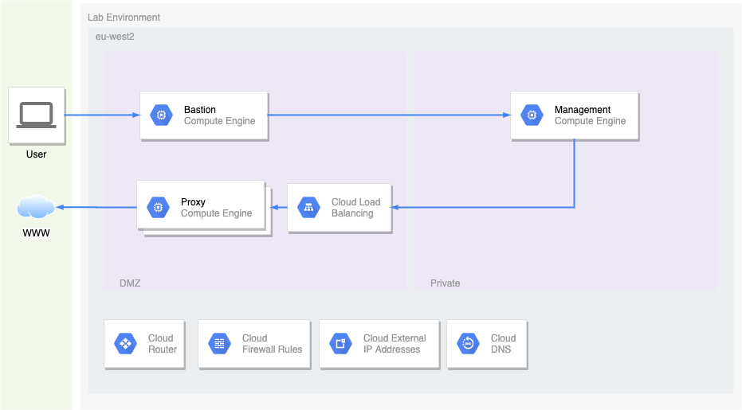

# Exercise

## Architecture
The diagram below describes the architecture, consisting of the following:
* VPC with DMZ and Private subnets
* Bastion GCE instance
* Proxy GCE managed instance group
* Management GCE instance

In addition to the above bear in mind the following:
* Automation
* Best practices
* Encryption
* Resilience
* Security

## Instructions
An outline of the main steps are listed below:

1. Create bastion instance
1. Create proxy managed instance group
1. Create internal load balancer for proxy managed instance group
1. Create management instance
1. Setup management instance for terraform
1. Deploy a compute instance to private subnet from the management instance using terraform

## Constraints
* Centos 7.x operating system
* No usage of Public IP addresses in the private subnet
* No usage of Cloud NAT
