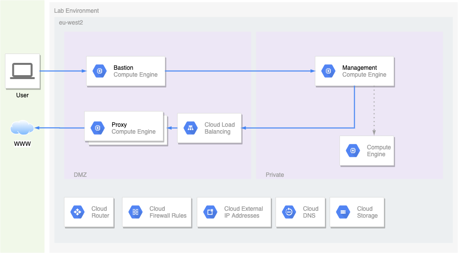

# Lab 1 - Segregated Environment

# Description
The purpose of this lab is to create a segregated environment with no direct internet connectivity in the private subnet.  

The user's OAuth2 credentials are used to impersonate the automation service account and create terraform resources.
 
The terraform script consists of multiple deployment stages:
1. Bootstrap
1. Stage 2

## Architecture
The diagram below describes the architecture, consisting of the following resources:
* Bastion GCE instance
* Proxy GCE managed instance group
* Management GCE instance



# Usage
## Authentication
Terraform requires the authentication method below setup for this lab:
* gcloud auth application-default login

## Pre-requisites
Create the file named vars/common.tfvars and populate variables accordingly.
```hcl
region                  = "europe-west2"
project_id              = "gcp-project-id"
project_name            = "my-project"
project_sponsor         = "joe-bloggs"
project_technical_lead  = "joe-bloggs"
cost_code               = "123456"
business_name           = "dept-1"
creator                 = "owner"
iam_user_email          = "user@domain"
```

Create the file named vars/ws-dev1.tfvars and populate variables accordingly.
```hcl
# ws-dev1.tfvars
```

Enable the APIs below on your project:
```shell script
for api in \
    cloudkms.googleapis.com \
    cloudresourcemanager.googleapis.com \
    compute.googleapis.com \
    iam.googleapis.com \
    iap.googleapis.com \
    storage-api.googleapis.com; \
    do; \
        echo enabling $api; \
        gcloud services enable $api; \
    done 
```

## Bootstrap
This stage deploys the following components:
* Automation service account
* GCS Bucket for terraform state
* KMS Key Ring
* KMS Key Crypto Key

The commands below will download the required terraform executable and initialise the terraform state bucket.
```shell script
make bootstrap-init
make bootstrap-plan
make bootstrap-apply
```

## Stage 2 Deployment
The commands below will deploy the infrastructure components to GCP.
```shell script
make init 
make plan 
make apply
```

## Stage 2 Deletion
The commands below will destroy the infrastructure components in GCP.
```shell script
make destroy
 ```

## Deploy into another terraform workspace
Create the file named vars/ws-*dev2*.tfvars and populate variables accordingly.

The command below will deploy all the components into the terraform workspace *dev2*.
```shell script
WS=dev2 make init 
WS=dev2 make plan 
WS=dev2 make apply
```

## (Mostly) complete deletion of all resources
The commands will destroy the Component Deployment as well as the bootstrap deployment
```shell script
make destroy
make clean
make bootstrap-destroy
make bootstrap-clean
```
NOTE: This process is mostly complete as the Cloud KMS keys and key rings are left behind as currently there isn't a process to delete all key versions

# Exercise
Details of the lab exercise are detailed in [EXERCISE.md](EXERCISE.md).

# Parameters

## Providers

| Name | Version |
|------|---------|
| google | ~> 3.7 |
| http | ~> 1.1 |
| random | ~> 2.2 |

## Inputs

| Name | Description | Type | Default | Required |
|------|-------------|------|---------|:-----:|
| automation\_service\_account | Automation service account | `string` | n/a | yes |
| business\_name | n/a | `string` | n/a | yes |
| cost\_code | n/a | `string` | n/a | yes |
| creator | Creator name | `string` | n/a | yes |
| impersonate\_user\_email | Impersonate user email | `string` | n/a | yes |
| kms\_key | KMS key URI | `string` | n/a | yes |
| project\_id | Project ID to create resources | `string` | n/a | yes |
| project\_name | n/a | `string` | n/a | yes |
| project\_sponsor | n/a | `string` | n/a | yes |
| project\_technical\_lead | n/a | `string` | n/a | yes |
| region | Region to create resources | `string` | n/a | yes |
| bucket\_prefix | Bucket name prefix | `string` | `"transfer"` | no |
| create\_nat\_gateway | Create nat gatway for internal servers | `bool` | `false` | no |
| enable\_flow\_logs | Enable flow logging | `string` | `true` | no |
| environment | Environment name | `string` | `"dev"` | no |
| gce\_service\_account\_prefix | GCE service account prefix | `string` | `"gce"` | no |
| gce\_service\_account\_roles | GCE service account roles | `list(string)` | <pre>[<br>  "roles/logging.logWriter",<br>  "roles/monitoring.metricWriter",<br>  "roles/monitoring.viewer"<br>]</pre> | no |
| health\_check\_source\_cidrs | Health check cidrs | `list(string)` | <pre>[<br>  "35.191.0.0/16",<br>  "130.211.0.0/22"<br>]</pre> | no |
| iap\_source\_cidrs | IAP cidrs | `list(string)` | <pre>[<br>  "35.235.240.0/20"<br>]</pre> | no |
| mgmt\_source\_cidr | Management CIDR for remote access | `list(string)` | `[]` | no |
| network\_cidr | Network CIDR | `string` | `"10.128.0.0/16"` | no |
| router\_prefix | Router name prefix | `string` | `"rtr"` | no |
| vpc\_prefix | VPC name prefix | `string` | `"vpc"` | no |

## Outputs

| Name | Description |
|------|-------------|
| automation\_service\_account | n/a |
| impersonate\_service\_account | n/a |
| labels | n/a |
| private\_subnet\_ip\_cidr\_range | n/a |
| private\_subnet\_name | n/a |
| public\_subnet\_ip\_cidr\_range | n/a |
| public\_subnet\_name | n/a |
| transfer\_bucket\_name | n/a |
| vpc\_name | n/a |
